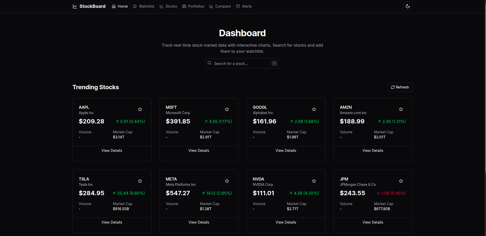

# Stock Market Dashboard

A modern, responsive stock market dashboard built with Next.js, React, and TypeScript. Track stocks, create portfolios, set price alerts, and compare performance - all in one application.



## Features

### Dashboard
- View trending stocks
- Real-time stock data updates
- Responsive design for all devices

### Stock Details
- Comprehensive stock information
- Historical price charts with multiple timeframes
- One-click add to watchlist

### Stock Comparison
- Compare multiple stocks side-by-side
- View normalized percentage changes or actual prices
- Customizable time ranges

### Portfolio Management
- Create and manage multiple portfolios
- Add/remove stocks from portfolios
- Track portfolio performance

### Price Alerts
- Set alerts for price targets
- Get notified when stocks reach your target
- Support for above/below price conditions

## Technology Stack

- **Framework**: Next.js 14
- **Language**: TypeScript
- **UI Components**: 
  - Shadcn UI
  - Radix UI
  - Lucide React Icons
- **State Management**: React Context API
- **Charting**: Recharts
- **Animations**: Framer Motion
- **API**: Finnhub Stock API

## Getting Started

### Prerequisites

- Node.js 18.x or higher
- npm or yarn

### Installation

1. Clone the repository
```bash
git clone https://github.com/Abhinavexists/StockBoard.git
cd stock-market-dashboard
```

2. Install dependencies
```bash
npm install
# or
yarn install
```

3. Create a `.env.local` file in the root directory with your Finnhub API key:
```
NEXT_PUBLIC_FINNHUB_API_KEY=your_api_key_here
```

4. Start the development server
```bash
npm run dev
# or
yarn dev
```

5. Open [http://localhost:3000](http://localhost:3000) in your browser

## Usage

### Searching for Stocks
- Use the search bar to find stocks by symbol or company name
- Click on a stock to view its detailed information

### Creating a Portfolio
1. Navigate to the Portfolios page
2. Click "New Portfolio"
3. Enter a name for your portfolio
4. Use the search function to add stocks

### Setting Price Alerts
1. Go to the Alerts page
2. Click "New Alert"
3. Select a stock and set your target price
4. Choose whether you want to be alerted when the price goes above or below your target

### Comparing Stocks
1. Visit the Compare page
2. Search and add multiple stocks
3. Switch between "Relative %" and "Actual $" views
4. Change the timeframe using the tabs

## Local Storage

The app uses browser local storage to persist:
- Watchlist
- Portfolios
- Price alerts

No server-side database is required for personal use.

## License

This project is licensed under the MIT License - see the LICENSE file for details.

For now the Finhub API is hardcoded.